# Workshop: Ansible Tower Basic Setup

Here students are tasked with installing and activating a new single integrated instance of Ansible Tower. The assignment will show students how they can setup an instance of Ansible Tower themselves to run an existing playbook for testing, demos and their own proof-of-concepts.

## Tips

This workshop can be presented in a classroom setting as a guided exercises to save a bit of time. The facilitator has the students follow along as they step thru each part of the corresponding demo.

Stepping thru the solution provides an excellent opportunity to briefly mention other features in Tower such as schedule jobs not explored in this workshop assignment.

## Solution

The focus of this exercise is to familiarize students with how to use the Ansible Tower UI. The following screenshots approximate the steps required to complete the workshop.

### 1

First we will need to create the inventory in which our hosts will be housed. To do so, simply select that Inventory tile at the top of your Ansible Tower dashboard
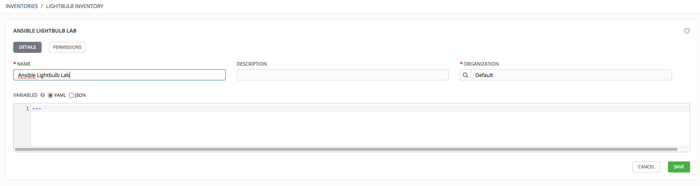

### 1.a

As we spoke about before, this step is something that is not widely done in production as you can take advantage of Ansible Tower's dynamic inventory support. To create a host, simply select "+Add Host"
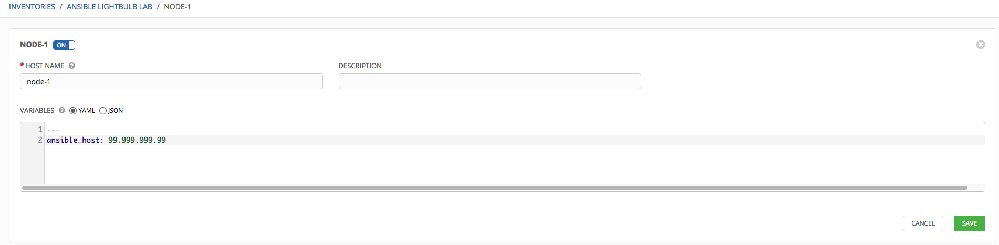

### 1.b

Once you have put in the necessary information for one host, click Save and it will return you to your respective Inventory page. From here, you can either add more hosts or move on to the things needed to connect to the machines, credentials.
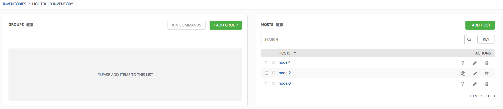

### 2

Credentials are essential in automating with ansible. To create a credential within Ansible Tower, select the gear in the top right hand corner of the screen. This will take you to the admin where you can select credentials box. This will display any current credentials you have in your Tower instance. To create a new credential, simply click +Add. This will bring up a new page where you can enter the relevant information for your credential. Since we are creating a machine credential, we will select machine from the Type dropdown and enter the needed information. Once done, select save and your credential will be saved.

### 3

Adding a project to Ansible Tower so that you can use your playbooks is very simple. To start the process, simply select the Project tile from the top of your Ansible Tower dashboard. This will display any current projects that you have added to your Tower Instance. From here, select "+Add" to create a new project. This will then display the New Project page. From here, you can add the required information to get your repository added as a project.
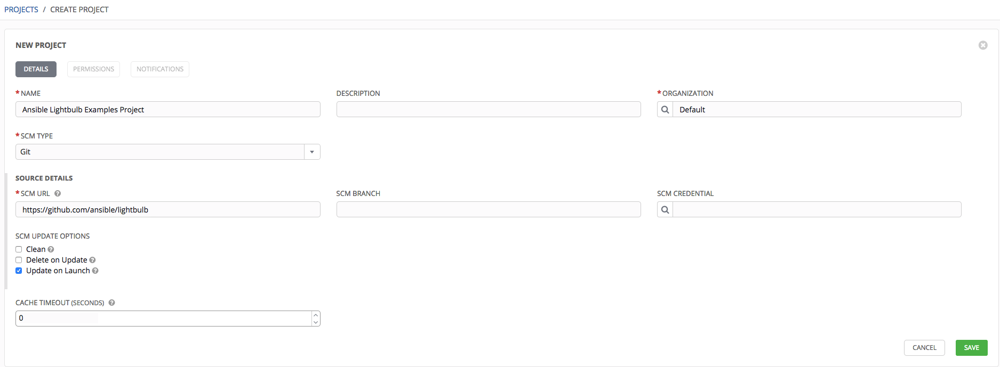

### 4

Job templates are a visual realization of the ansible-playbook command and all flags you can utilize when executing from the command line. Everything you used on the command line, such as calling the invenotry or specifying a credential is done here. Creating a job template is simple and direct. Everything you need for it is outlined but has extra options and capabilities to make it even more powerful. To create a Job Template, simply select "Templates" tile from the top of your Ansible Tower dashboard. This will bring you to the Templates page where any current templates you have created will be shown. To create a new one, click the +Add drop down box and select Job Templates. Here, everything that you can add to your Job Templates can be found here. The portions that are denoted with a * are a required option, things such as credentials, which project and playbook you want to use are all needed before you can save the Template.
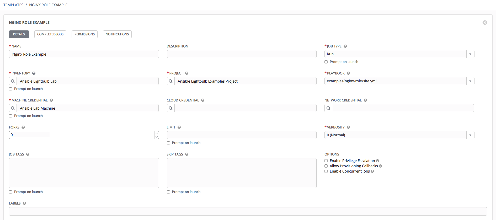

### 5

Launching a Job Template in Ansible Tower is easy. If you are starting from your Ansible Tower dashboard, just select Templates and the templates that you have created will be there (including the one that you just created for the previous example) Once you are at the templates page, next to each template, there is a rocket. Once you click that, Ansible Tower will start to execute that job. Launching a task in ansible tower is that simple.

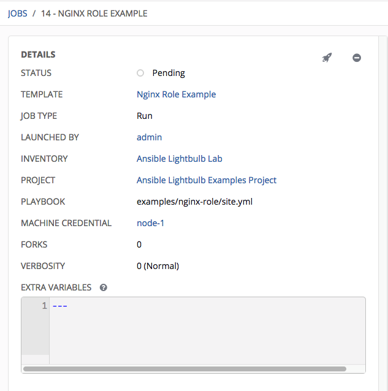

### 5.a

Seeing a successful job means that the changes that were outlined were completed. On the details panel, everything that you need to know from the date to who launched the job to what inventory the template was run against can be found there. You can also search through previous job runs and see this exact information for each time this job was run.
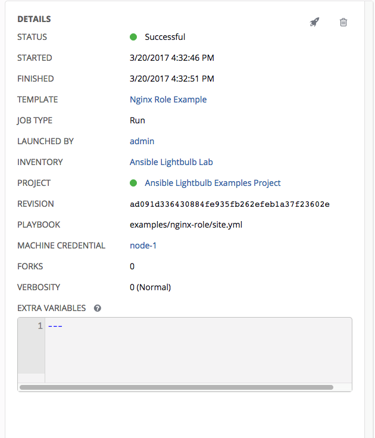

### 6

Extra Variables are variables that can be passed in many parts of Ansible Tower. From Inventory configuration, Job Templates and Surveys, extra variables can be tricky if they are not kept track of. For example, say that you have a defined variable for an inventory for debug = true. It is entirely possible that this variable, debug = true, can be overridden in a job template survey.

To ensure that the variables you need to pass are not overridden, ensure they are included by redefining them in the survey. Keep in mind that extra variables can be defined at the inventory, group, and host levels.
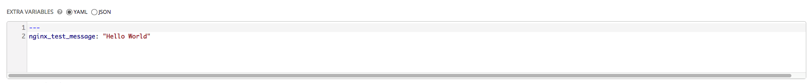

NOTE: These screenshots where taken using Ansible Tower 3.1.1.

* Settings Icon and Credentials Card
* Create Machine Credential
* Create Group
* Create Hosts (under Group)
* Create Project
* Create Template
* Extra Variables

## Extra Credit

* Create Users
* Assign Execution Permission to User in Job Templates
* User Surveys

### Create Users

Creating users is simple and easy. To get other people on your team involved, select the settings gear in the top right and select users. This will take you to the users page. Select the green “+Add” button and a user creation page will be displayed. From here, you will need to enter some information about the user such as their name and email address. Once you have added the necessary information, click save and the user will be added to your Ansible Tower instance!
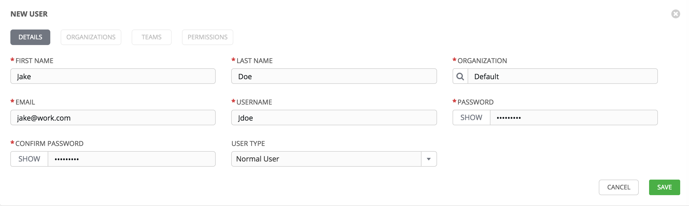

### Assign Execution Permission

Assigning permissions to users on what they can and cannot do, what they can and cannot see is crucial to the Ansible Tower story. Role Based Access Control (RBAC) is at the core of how Tower scales organizations while increasing the security of automating. By delegating access to resources within tower, you are removing an element of human error.

Assigning Execution permissions is a big step in implementing RBAC throughout your team. To add execution permissions for users on a Job Template, navigate to the job template that you would like the user(s) to have execution permission on. Once you are on the editing page for this job template (pencil) select the "Permissions" box at the top then click the "+Add" box on the right hand side.

This will display a box that displays users and teams within your Organization. Select the Users box (Tower does by default) then select the user you wish to add to the Job Template. This will prompt a drop down selection to appear for the role. From that drop-down box, select "Execute" and hit Save.

It is done! That user know has execution privileges on that Job Template!
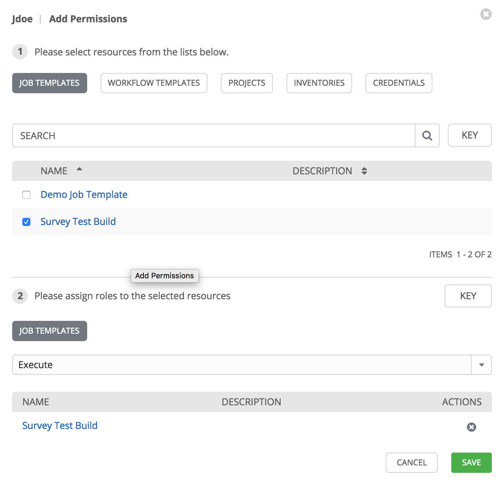

### User Surveys

Job types of Run or Check will provide a way to set up surveys in the Job Template creation or editing screens. Surveys set extra variables for the playbook similar to ‘Prompt for Extra Variables’ does, but in a user-friendly question and answer way. Surveys also allow for validation of user input. (Don't forget our earlier discussion about Extra variables, survey answers are passed as Extra Variables so make sure you don't over ride variables with Survey Questions)

Use cases for surveys are numerous. An example might be if operations wanted to give developers a “push to stage” button they could run without advanced Ansible knowledge. When launched, this task could prompt for answers to questions such as, “What tag should we release?” Many types of questions can be asked, including multiple-choice questions.

To create a survey, navigate to the Job Template you wish to add the survey to and select the blue "Add Survey" button from the top. From here, a blank survey form will appear for you to fill out.
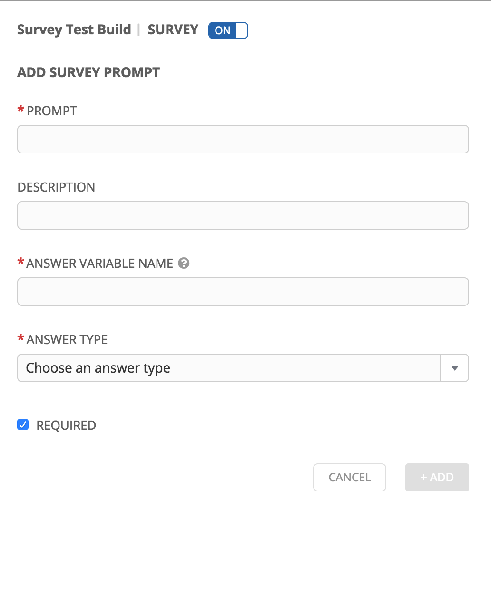
From here you will fill out the prompt, the Answer Variable name and the type of answer that will be provided. Examples can include Integers, Text, and passwords.

Once you have everything filled out to your liking, click the Add button and the survey will now be prompt each user that attempts to execute the Job Template.
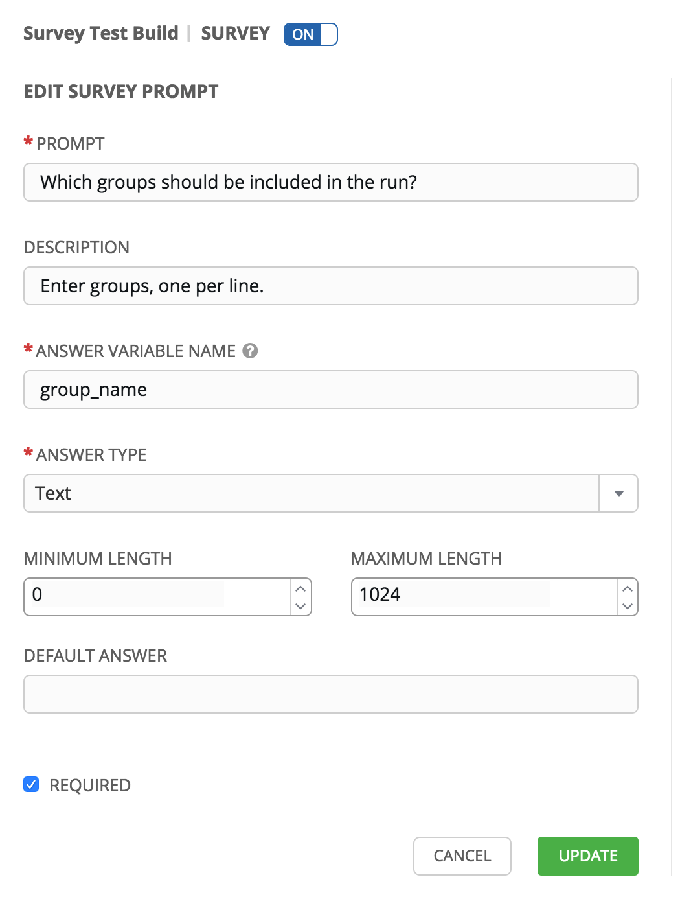
