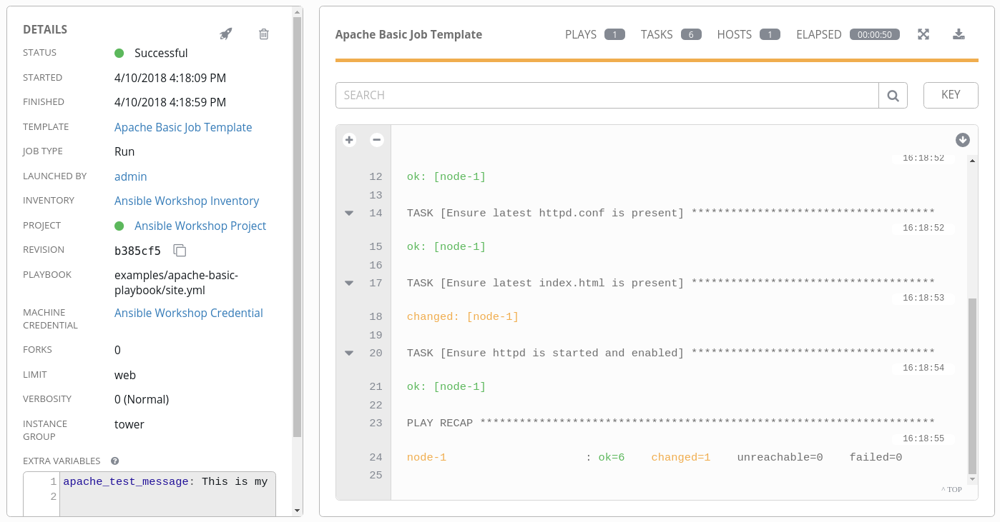
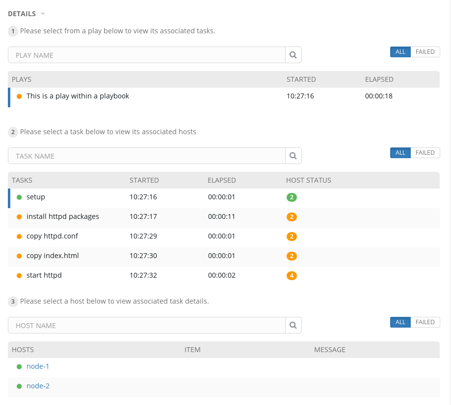
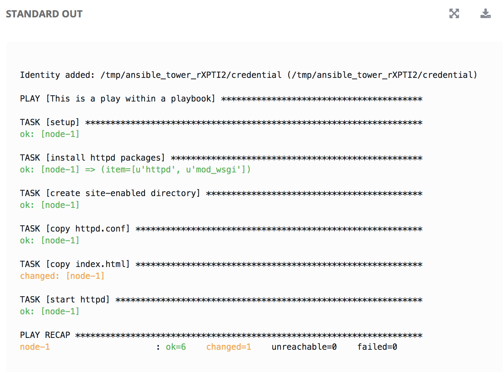

# Exercise 3 - Creating and Running a Job Template

A job template is a definition and set of parameters for running an Ansible job. Job templates are useful to execute the same job many times.

## Creating a Job Template

### Step 1

Select TEMPLATES

### Step 2

Click on ADD , and select JOB TEMPLATE

### Step 3

Complete the form using the following values

|OPTION|VALUE
|------|-----
|NAME |Apache Basic Job Template
|DESCRIPTION|Template for the apache-basic-playbook
|JOB TYPE|Run
|INVENTORY|Ansible Workshop Inventory
|PROJECT|Ansible Workshop Project
|PLAYBOOK|examples/apache-basic-playbook/site.yml
|MACHINE CREDENTIAL|Ansible Workshop Credential
|LIMIT|web
|OPTIONS|Check _Enable Privilege Escalation_


### Step 4

Click SAVE  and then select ADD SURVEY 

### Step 5

Complete the survey form with following values

|OPTION|VALUE
|------|-----
|PROMPT|Please enter a test message for your new website
|DESCRIPTION|Website test message prompt
|ANSWER VARIABLE NAME|apache_test_message
|ANSWER TYPE|Text
|MINIMUM/MAXIMUM LENGTH| Use the defaults
|DEFAULT ANSWER| Be creative, keep it clean, we're all professionals here


### Step 6

Select ADD 

### Step 7

Select SAVE 

### Step 8

Back on the main Job Template page, select SAVE  again.

## Running a Job Template

Now that you’ve sucessfully created your Job Template, you are ready to launch it. Once you do, you will be redirected to a job screen which is refreshing in realtime showing you the status of the job.

### Step 1

Select TEMPLATES

---
**NOTE**: Alternative way to navigate to TEMPLATES
Alternatively, if you haven't navigated away from the job templates creation page, you can scroll down to see all existing job templates

---

### Step 2

Click on the rocketship icon  for the *Apache Basic Job Template*

### Step 3

When prompted, enter your desired test message


### Step 4

Select LAUNCH 

### Step 5

Wait and watch the execution of the job.

One of the first things you will notice is the summary section.  This gives you details about your job such as who launched it, what playbook it's running, what the status is, i.e. pending, running, or complete. You’ll also notice the `apache_test_message` being passed in the field EXTRA VARIABLES.



Scrolling down, you will be able to see details on the play and each task in the playbook.



To the right, you can view standard output; the same way you could if you were running `ansible-playbook` from the command line.



You can also click on the nodes in the standard output under a specific task for additional information.

### Step 6

Once your job is sucessful, navigate to your new website:

```bash
http://<IP_of_node-1_or_node-2>
```

If all went well, you should see something like this, but with your own custom message:


## End Result

At this point in the workshop, you've experienced the core functionality of Ansible Tower. To read more about advanced features of Tower, take a look at the resources page in this guide.

---

[Click Here to return to the Ansible Lightbulb - Ansible Tower Workshop](../README.md)
