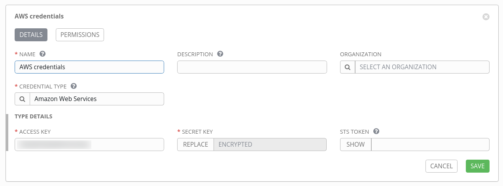
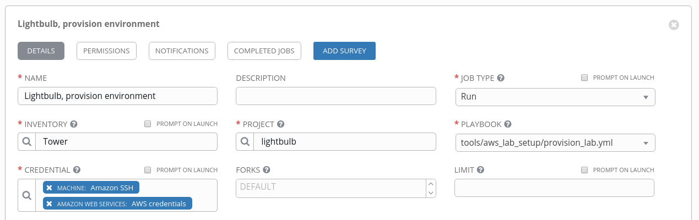

# Controlling lightbulb from within Tower

While this guide expects that the lightbulb environment is provisioned from the command line, it is actually possible to run the entire environment from within Tower. To do so, the following steps are required.

## Prepare Ansible environment on a Tower

Lightbulb requires multiple libraries to be present. While `boto` and `boto3` are shipped as part of Tower, `passlib` is necessary. So it needs to be installed in the [Tower Ansible environment](http://docs.ansible.com/ansible-tower/latest/html/upgrade-migration-guide/virtualenv.html).

```bash
$ ssh tower.example.com
$ sudo -i
# . /var/lib/awx/venv/ansible/bin/activate
(ansible) # pip install passlib
```

## Add credentials and project to Ansible Tower

1. Create [AWS credentials](http://docs.ansible.com/ansible-tower/latest/html/userguide/credentials.html#amazon-web-services): In Tower, go to "SETTINGS", "CREDENTIALS", click on "+ADD", enter a name, pick the "CREDENTIAL TYPE" "Amazon Web Services" and fill in the necessary details.
1. Create [machines credentials](http://docs.ansible.com/ansible-tower/latest/html/userguide/credentials.html#machine) containing your AWS SSH key.
1. Add a [new project](http://docs.ansible.com/ansible-tower/latest/html/userguide/projects.html#add-a-new-project), the Lightbulb Github repository, to Tower: Create a new Tower project, and add [lightbulb]() as source repository.



## Create Provision Job Template in Ansible Tower

1. Create a new [job template](http://docs.ansible.com/ansible-tower/latest/html/userguide/job_templates.html) with the Git repo as project.
1. Use an [inventory](http://docs.ansible.com/ansible-tower/latest/html/userguide/inventories.html) only containing localhost.
1. As credentials, use the Amazon Web Services and also the corresponding machines credentials created above.
1. The playbook needs to be `tools/aws_lab_setup/provision_lab.yml`.
1. In the "EXTRA VARIABLES" field, provide the variables necessary for the AWS provider, like list of users, `ec2_name_prefix`, and so on.



## Create Teardown Job Template in Ansible Tower

1. Copy the just created job template.
1. Change the playbook to `tools/aws_lab_setup/teardown_lab.yml`.

That's already it. The proper function is ensured via the variables.
